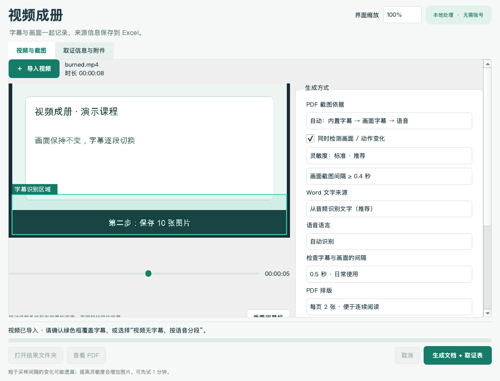

# VideoNotes · 视频成册

[](https://github.com/funkyZhaofour/VideoNotes/actions/workflows/test.yml)
[](LICENSE)

**Turn local videos into Word transcripts, screenshot PDFs and an Excel evidence log.**

把网课、录屏和本地视频整理成可以翻阅的文字稿、图文 PDF 和来源记录表。支持 **macOS / Windows**；日常处理在本机完成，无需账号或 API 密钥，不上传视频。

> **使用前请阅读[免责声明与使用边界](DISCLAIMER.md)。** 自动识别结果需人工核对；本项目不提供公证、司法鉴定、可信时间戳或法律意见，不保证材料被采纳。“取证”字段只是整理标签。使用者应确认素材使用权、核实填写信息并保护隐私。责任限制仅在适用法律允许的范围内有效，不排除依法不能免除的责任。

## 功能

- **Word 文字稿**：从音频识别中文、英语、粤语、日语、韩语，或使用原字幕文字。
- **截图 PDF**：按字幕变化和画面变化取图，可捕捉局部动作、表情包、课件或镜头切换。
- **可调检测**：框选字幕区域；选择灵敏度和 0.2 / 0.5 / 1 秒采样；PDF 每页一张或两张图。
- **自选保存路径**：选择保存位置，并自行命名本次结果文件夹；界面显示最终路径，不覆盖已有文件夹。
- **取证信息和 Excel 台账**：手动登记平台、作者、UID、发布时间、文案、链接、传播数据、权利卫士记录、可信时间戳证书信息及处理进展；每次只在末尾追加一条记录。
- **附件**：导入自己保存的评论区或网页截图，与结果一起保存并记录文件名。
- **方便操作**：拖入视频、先试一分钟、调整窗口大小、滚动设置、80%–125% 字体缩放。



## 下载与安装

从 [Releases](https://github.com/funkyZhaofour/VideoNotes/releases) 下载源码安装包，或点击 **Code → Download ZIP**，解压到你准备长期保留的文件夹。

当前提供的是带安装脚本的源码版本，**不是无需环境的单文件 EXE 或通用 Mac 安装包**。首次安装需要联网下载依赖、语音模型和必要的视频工具；之后处理视频无需联网。建议预留 2 GB 安装空间和足够的结果保存空间。

### Windows 10 / 11（64 位 Intel / AMD）

1. 安装 [Python 3.11 或 3.12 的 64 位版本](https://www.python.org/downloads/windows/)，保留 Python Launcher，或勾选加入 PATH。
2. 解压项目，双击 **`Setup-Windows.cmd`**，等待安装完成。
3. 双击桌面的 **VideoNotes** 快捷方式，或项目里的 **`Start-Windows.cmd`**。

安装会创建独立环境，并在需要时下载 FFmpeg / FFprobe 到本项目的 `bin` 文件夹，不要求你手动配置全局 PATH。Windows 的字幕识别使用本地 RapidOCR。Windows ARM 原生运行未验证。

### macOS 14 及以上

1. 准备 Python 3.11 / 3.12、FFmpeg 和 Xcode Command Line Tools。使用 Homebrew 时可以运行：

   ```sh
   brew install python@3.11 ffmpeg
   xcode-select --install
   ```

2. 双击 **`Setup-Mac.command`**，等待安装完成。
3. 打开桌面的 **视频成册.app**，或运行 **`Start-Mac.command`**。

若下载的脚本没有执行权限，在项目文件夹运行 `chmod +x *.command`。Mac 的字幕识别使用系统 Apple Vision。桌面图标只是入口，请保留解压后的项目文件夹；移动它之后需要重新安装入口。

## 使用

1. 导入本地视频。已有 SRT / VTT / ASS 字幕可直接选择，视频旁的同名字幕会自动填入。
2. 拖动预览到有字幕的画面，用鼠标框住字幕。这个框只限制 OCR 区域，导出的截图仍保留完整画面。
3. 默认同时检测字幕和视觉变化。没有字幕的视频可选择“按语音分段”；没有声音也可以只生成画面记录。
4. 选择**保存位置**，填写**本次结果文件夹名**，或点“新建文件夹…”。文件夹在处理时创建。留空时自动按视频名和时间命名。
5. 如需取证台账，在“取证信息与附件”填写元数据、导入附件。
6. 先试前一分钟，确认效果后处理整个视频。完成后打开结果文件夹或 PDF。

例如保存位置选 `D:\资料`、结果文件夹名填 `证据001`，本次文件保存到 `D:\资料\证据001`。累计台账保存在 `D:\资料\取证台账.xlsx`。名字已经存在时会提示更换，不覆盖旧结果。

## 输出

| 文件 | 内容 |
|---|---|
| `文字稿.docx` / `文字稿.txt` | 音频转写或字幕文字，带原视频时间 |
| `字幕截图.pdf` | 完整截图、对应文字、实际截图时间及触发原因 |
| `截图/` | 可单独使用的 JPG 图片 |
| `截图对应字幕.srt` | 文字字幕时间轴；额外画面变化记录在 JSON 中 |
| `音频转写.srt` | 执行语音识别时生成的分段文字 |
| `取证信息.xlsx` / `取证信息.json` | 本条记录的来源信息和输出信息 |
| `评论区等附件/` | 手动导入的附件副本，不自动追加到 PDF |
| `处理记录.json` / `阅读说明.txt` | 设置、时间、警告、文件校验值和截图信息 |
| `免责声明与使用边界.txt` | 随本次结果保存的完整声明 |
| 保存位置下的 `取证台账.xlsx` | 逐次追加的累计记录，可直接用 Excel 编辑 |

## 取证信息表

包括：证据编号、是否取证、平台、账号类别、发布者或作者、ID / UID、发布时间、发布地点 / IP 属地、标题、文案、链接、涉及内容 / 疑似侵权点、取证日期时间、取证地点、取证文件名、权利卫士记录、可信时间戳证书信息、浏览量、点赞、收藏、转发、评论数、数据观察时间、平台处理状态及详情、投诉编号、处理时间和备注。

- **来源信息手动填写**。程序不会从链接抓取账号、评论或数据，也不会推断发布地点或时间。
- 未知数据留空，可原样填写“1.2万”“不可见”。空白不等于零，UID 按文本保存。
- 取证时间由你填写；导出起止时间由本机时钟另行记录，并带时区。
- 第三方取证处采用产品正式名称“权利卫士”。可登记是否使用、权利卫士内记录名称、证据名称、证据 / 存证编号、固化时间、原始取证文件名、认证证书文件名及分享 / 验证链接。
- 可另行登记第三方可信时间戳的服务名称、证书编号、签发时间、证书文件名、证书对应哈希及验证链接。请按第三方页面或证书原样填写；本程序不自动连接、签发或验证第三方服务。
- “是否取证”不会因为导出成功自动改成“是”。疑似侵权点是填写人的描述，程序不作判断。
- 程序记录原视频 SHA-256、截图数量、处理范围、输出文件和附件名称；证据编号印在 Word / PDF 标题中。原视频不改写，应另行保留。
- 点“追加一条信息到台账”可以登记尚未取证的内容；不会生成截图或复制附件。
- 每次保存或导出只在末尾追加新行，不按证据编号覆盖旧行。你可以直接在 Excel 中继续编辑旧记录。旧版台账缺少的新字段会自动加在最右侧；原有行、手工修改及自定义列保持原位置。试跑与完整导出分别记录处理范围。追加前请保存并关闭 Excel 中打开的台账。
- 权利卫士的录屏取证及证书说明可参考[联合信任时间戳服务中心的权利卫士说明](https://www.tsa.cn/scene/178.html)，可信时间戳证书可通过其[验证中心](https://v.tsa.cn/)核验。第三方产品及服务由相应提供方负责，本项目与其无隶属或背书关系。

## 精度与限制

画面检测比较整体和局部视觉差异，**不识别人名或理解动作含义**。提高灵敏度可以捕捉较小变化，也可能因噪声或动画产生更多图片。短于采样间隔的片段、细微变化和模糊字幕可能遗漏。

OCR 主要面向中英文字幕。现成准确字幕通常比画面 OCR 更可靠。语音分段时间不等于原字幕切换时间；嘈杂录音、重叠说话、专有名词可能影响转写。

截图最大宽度 1600 像素；很长的图下注释会提示省略，完整文字保存在 SRT。长视频可能生成数百至数千张图片，请先试跑并留意存储空间。

只有本机可解码的视频文件可以处理，不提供网页下载或评论区自动抓取。Windows / Mac 自动测试检查功能流程，不代表对所有硬件、视频类型和识别准确率的保证。

## 本地数据

正常处理不上传视频、音频、截图或文字。临时音轨和图像在输出位置的隐藏临时文件夹中处理，完成或正常取消后清理；强制退出可能留下临时文件夹。

`草稿/` 保存按视频路径对应的填写内容。模型、环境、草稿、取证输出和运行日志均被 `.gitignore` 排除，分享安装过的项目文件夹前仍应检查实际内容。项目源码 ZIP 不包含这些数据。

## English quick start

VideoNotes is a local desktop tool for timestamped Word transcripts, subtitle/visual-change screenshot PDFs, and a manually maintained Excel evidence log. The interface is currently Chinese. It does not scrape websites or upload media.

Read the [disclaimer](DISCLAIMER.md#english-summary): outputs require human verification and are not notarized, certified or guaranteed admissible. Applicable non-waivable rights and liabilities remain unaffected.

On Windows x64, install Python 3.11 or 3.12 and run `Setup-Windows.cmd`. On macOS, install Python 3.11/3.12, FFmpeg and command-line developer tools, then run `Setup-Mac.command`. Setup downloads dependencies and models once; keep the source folder after installing the Desktop launcher.

See [CONTRIBUTING.md](CONTRIBUTING.md) for tests and contributions. Source code is [MIT licensed](LICENSE); third-party software and models retain their own terms listed in [THIRD_PARTY.md](THIRD_PARTY.md).
